# Product Requirements Document (PRD) — Agro Prima Greenhouse

## 1. Project Identity & Overview
- **Project Name:** Agro Prima Greenhouse Web Platform
- **Project Slug:** `agroprimagreenhouse`
- **Domain Target:** `agroprimagreenhouse.com`
- **Hosting & Infrastructure:** **Cloudflare Pages / Vercel Edge** (Global Edge CDN, DNS, Polish Image Caching).
- **Tech Stack:** Astro v5+ (Static-First / SSG), Tailwind CSS, TypeScript (Strict), Astro Content Collections (Zod Schemas), Lucide Icons, Preact Islands (for interactive estimator & search).
- **Visual Theme:** **Dutch High-Tech Glasshouse Aesthetic** (Deep emerald `#064e3b`, fresh mint cyan `#10b981` / `#34d399`, pristine cool canvas `#f8fafc`, solar royal amber `#f59e0b`, high-contrast typography, and authentic greenhouse structural imagery).
- **Core Positioning:** "Membangun Greenhouse Modern yang Lebih Kokoh, Presisi, dan Tahan Iklim Tropis — Kontraktor Spesialis Jasa Pembuatan Greenhouse Seluruh Indonesia".
- **Primary Business Goals:**
  1. Generate high-intent WhatsApp leads and quote requests for custom greenhouse projects (Pipa Galvanis Hot-Dip, Baja Ringan, Bambu Awet, Tunnel Garam Prisma, Smart Farming IoT).
  2. Provide transparent online RAB calculation and structural consultations for commercial horticulture & farming investors.
  3. Supply premium greenhouse construction materials (Plastik UV 200µm 14%, Paranet Shading Net, Insect Net 50 Mesh, Spring Clip Kanal C, Selang Drip) across Indonesia.
  4. Deliver 100/100 Core Web Vitals on edge delivery with instant mobile performance.

---

## 2. Business Entity & Canonical NAP
- **Brand Name:** Agro Prima Greenhouse
- **Legal Entity:** Agro Prima Greenhouse Malang
- **Physical Address:** Jl. KH. Malik Dalam RT 01 RW 07, Buring, Kedungkandang, Kota Malang, Jawa Timur 65136, Indonesia
- **Official WhatsApp:** `+62 851-8300-2070` (`0851-8300-2070`)
- **Official Email:** `agroprimagreenhouse@gmail.com`
- **Google Maps Pin:** `https://share.google/RkGZAeLgftgFwjqRo`
- **Operating Hours:** Buka Setiap Hari (Konsultasi Teknis & RAB 24 Jam) / Workshop: 07.30 - 17.00 WIB
- **Coverage Scope:** Workshop di Malang + Pengerjaan Konstruksi Greenhouse & Ekspedisi Material ke Seluruh Indonesia

---

## 3. User Personas & Workflows
1. **Petani & Kelompok Tani Lokal (Malang & Jatim):** Mencari toko saprodi/pupuk/benih/alat terdekat yang terpercaya, jam buka jelas, stok valid, dan ada petunjuk Google Maps.
2. **Pengusaha Hortikultura & Agribisnis Komersial (Nasional):** Mencari kontraktor greenhouse (Galvanis/Baja Ringan) dengan portfolio nyata, estimasi RAB transparan, dan kesiapan instalasi luar pulau.
3. **Petani Garam & Pengolah Pesisir:** Membutuhkan instalasi spesifik Tunnel Garam untuk peningkatan kualitas dan percepatan kristalisasi garam.
4. **Penghobi Tanaman & Urban Farming:** Membutuhkan greenhouse bambu/mini, paranet, plastik UV eceran, tray semai, dan instalasi fertigasi/drip.

---

## 4. Information Architecture & URL Routing Structure

```mermaid
graph TD
    A["Homepage (/)"] --> B["Katalog Produk (/produk/)"]
    A --> C["Jasa Greenhouse (/jasa/pembuatan-greenhouse/)"]
    A --> D["Wilayah Layanan (/wilayah-layanan/)"]
    A --> E["Portofolio Proyek (/proyek/)"]
    A --> F["Artikel Edukasi (/artikel/)"]
    A --> G["Profil & Hubungan"]
    
    B --> B1["Saprodi Pertanian (/produk/saprodi-pertanian/)"]
    B --> B2["Perlengkapan Pertanian (/produk/perlengkapan-pertanian/)"]
    B --> B3["Perlengkapan Greenhouse (/produk/perlengkapan-greenhouse/)"]
    B --> B4["Detail Produk (/produk/[slug]/)"]
    
    C --> C1["Greenhouse Bambu"]
    C --> C2["Greenhouse Galvanis"]
    C --> C3["Greenhouse Baja Ringan"]
    C --> C4["Tunnel Garam"]
    
    E --> E1["Studi Kasus Proyek (/proyek/[slug]/)"]
    F --> F1["Detail Artikel (/artikel/[slug]/)"]
    
    G --> G1["Tentang Kami (/tentang-kami/)"]
    G --> G2["Lokasi Toko Malang (/lokasi/)"]
    G --> G3["Kontak (/kontak/)"]
    G --> G4["FAQ (/faq/)"]
```

### Route Index:
- `/` — Homepage: Local Malang Trust + National Agricultural & Greenhouse Hub.
- `/produk/` — Master Product Catalog Hub with instant category filtering.
- `/produk/saprodi-pertanian/` — Category: Pupuk, pestisida, benih, media tanam.
- `/produk/perlengkapan-pertanian/` — Category: Sprayer, mulsa plastik, selang drip, alat siram.
- `/produk/perlengkapan-greenhouse/` — Category: Plastik UV 14%-20%, paranet 50%-85%, spring clip, profile lock.
- `/produk/[slug]/` — Individual Product Spec & WA Direct Order.
- `/jasa/pembuatan-greenhouse/` — Core Service Landing Page: Bambu, Galvanis, Baja Ringan, Tunnel Garam + RAB Quote Calculator.
- `/wilayah-layanan/` — Service coverage nationwide: logistic mechanisms, survey phases, installation teams.
- `/proyek/` & `/proyek/[slug]/` — Real case studies with before/process/after photos, specs, and timeline.
- `/artikel/` & `/artikel/[slug]/` — High-intent commercial SEO guides (biaya, perbandingan plastik UV, jenis irigasi).
- `/tentang-kami/` — Business credibility, physical warehouse in Malang, company principles.
- `/lokasi/` — Local SEO anchor: Google Maps embed, landmarks, directions from Terminal Gadang/Kota Malang.
- `/kontak/` — Full NAP, contact form, direct WhatsApp routing with UTM parameter capture.
- `/faq/` — General & technical FAQ with Accordion structured data.
- `/404` — Branded helpful 404 page redirecting to primary categories.
- `/robots.txt` & `/sitemap-index.xml` — Automated SEO crawlers endpoints.

---

## 5. Functional Requirements (EARS Format)
- **REQ-01 (Catalog Navigation):** *When* a visitor accesses `/produk/`, *the system shall* display categorized products with responsive filter pills, search bar, and instant WhatsApp inquiry triggers.
- **REQ-02 (Interactive PDP Variant Selector):** *When* a customer selects a product variant (e.g. Plastik UV 14% vs 20%, Paranet 65% vs 75% vs 85%, roll dimensions), *the system shall* dynamically update the price display, SKU, and unit specifications on the product detail page without page reload.
- **REQ-03 (Direct 1-Click Buy to WhatsApp):** *When* a customer clicks "Beli Sekarang via WhatsApp" on `/produk/[slug]/`, *the system shall* immediately launch WhatsApp (`wa.me/6285183002070`) without any intermediate web form, containing a pre-filled structured message with: Product Name, Selected Variant, Quantity, Calculated Total Price, Product URL, and Customer Delivery Data template.
- **REQ-04 (Greenhouse Quote Builder):** *When* a customer configures dimensions on `/jasa/pembuatan-greenhouse/`, *the system shall* compute material specs and tier estimates, and generate a pre-formatted WhatsApp consultation message.
- **REQ-05 (Mobile Sticky Buy Dock):** *While* browsing a product on mobile viewports (< 768px), *the system shall* render a compact sticky bottom action bar displaying the dynamic variant price, quantity stepper, and direct "Beli via WA" CTA.
- **REQ-06 (Local SEO Structured Data):** *When* any page is rendered, *the system shall* inject JSON-LD schemas: `LocalBusiness/Store` on homepage/location, `Service` on greenhouse services, `Product` on product detail pages, `Article` on blog posts, and `BreadcrumbList` on all hierarchical routes.
- **REQ-07 (Cloudflare Edge Zero-Backend Performance):** *When* deployed to Cloudflare Pages, *the system shall* serve 100% pre-rendered static assets via Cloudflare global edge CDN with 0kB unnecessary client JS, achieving LCP < 0.8s and zero server/database operational cost.

---

## 6. Non-Goals (Scope Boundary)
- ❌ Zero web checkout forms / address forms on site (all customer address & cargo logistics discussions happen directly inside WhatsApp chat).
- ❌ Backend database or server-side API (pure Jamstack; product catalog is statically compiled via Astro Content Collections).
- ❌ Traditional admin panel / user auth / login portal (updates done via Git / markdown or optional lightweight client CMS).
- ❌ Direct online payment gateways (transactions are finalized via Bank Transfer / COD after direct WhatsApp verification with store CS).
- ❌ AI-hallucinated testimonials, fake project counters, or unverified claims.
