# Product Requirements Document (PRD) — Agrokomplek Cemerlang

## 1. Project Identity & Overview
- **Project Name:** Agrokomplek Cemerlang Web Platform
- **Project Slug:** `agrokomplek-cemerlang`
- **Domain Target:** `agroprimagreenhouse.com`
- **Hosting & Infrastructure:** **Cloudflare Pages / Cloudflare Workers** (Global Edge CDN, DNS, Zero-Trust Access, Cloudflare Web Analytics / Turnstile, Polish Image Caching).
- **Tech Stack:** Astro v5+ (Static-First / Hybrid SSG), Tailwind CSS v4, TypeScript (Strict), Astro Content Collections (Zod Schemas), Lucide Icons, React/Preact Islands (for interactive estimator & search).
- **Visual Theme:** **Madian / Modern Agritech Aesthetic** (Clean agricultural emerald/forest green `#195a36`, warm earthy sunlight amber `#d97706`, high-contrast typography, generous negative space, crisp border treatments, and authentic agricultural imagery).
- **Core Positioning:** "Pusat kebutuhan pertanian dan jasa pembuatan greenhouse Seluruh Indonesia — Dari Malang untuk Pertanian Indonesia".
- **Primary Business Goals:**
  1. Generate high-intent WhatsApp leads for agricultural supplies (saprodi) and farming equipment across Indonesia.
  2. Generate structured quote requests and survey inquiries for custom greenhouse projects (Bambu, Galvanis, Baja Ringan, Tunnel Garam).
  3. Establish local SEO authority in Malang (Kedungkandang / Buring) while ranking nationally for high-value transactional greenhouse & agritech keywords.
  4. Deliver 100/100 Core Web Vitals on Cloudflare Edge with zero-JS static baseline and instant mobile response.

---

## 2. Business Entity & Canonical NAP
- **Brand Name:** Agrokomplek Cemerlang
- **Physical Address:** Jl. KH. Malik Dalam RT 01 RW 07, Buring, Kedungkandang, Kota Malang, Jawa Timur 65136, Indonesia
- **Official WhatsApp:** `+62 851-8300-2070` (`0851-8300-2070`)
- **Official Email:** `agrokomplekcemerlang@gmail.com`
- **Google Maps Pin:** `https://share.google/RkGZAeLgftgFwjqRo`
- **Operating Hours:** 24 Jam (WhatsApp Consultation & Online Ordering) / Jam Operasional Fisik Toko
- **Coverage Scope:** Physical Store in Malang + Nationwide Product Shipping & Greenhouse Project Installation across Indonesia

---

## 3. User Personas & Workflows
1. **Petani & Kelompok Tani Lokal (Malang & Jatim):** Mencari toko saprodi/pupuk/benih/alat terdekat yang terpercaya, jam buka jelas, stok valid, dan ada petunjuk Google Maps.
2. **Pengusaha Hortikultura & Agribisnis Komersial (Nasional):** Mencari kontraktor greenhouse (Galvanis/Baja Ringan) dengan portfolio nyata, estimasi RAB transparan, dan kesiapan instalasi luar pulau.
3. **Petani Garam & Pengolah Pesisir:** Membutuhkan instalasi spesifik Tunnel Garam untuk peningkatan kualitas dan percepatan kristalisasi garam.
4. **Penghobi Tanaman & Urban Farming:** Membutuhkan greenhouse bambu/mini, paranet, plastik UV eceran, tray semai, dan instalasi fertigasi/drip.

---

## 4. Information Architecture & URL Routing Structure

```mermaid
graph TD
    A["Homepage (/)"] --> B["Katalog Produk (/produk/)"]
    A --> C["Jasa Greenhouse (/jasa/pembuatan-greenhouse/)"]
    A --> D["Wilayah Layanan (/wilayah-layanan/)"]
    A --> E["Portofolio Proyek (/proyek/)"]
    A --> F["Artikel Edukasi (/artikel/)"]
    A --> G["Profil & Hubungan"]
    
    B --> B1["Saprodi Pertanian (/produk/saprodi-pertanian/)"]
    B --> B2["Perlengkapan Pertanian (/produk/perlengkapan-pertanian/)"]
    B --> B3["Perlengkapan Greenhouse (/produk/perlengkapan-greenhouse/)"]
    B --> B4["Detail Produk (/produk/[slug]/)"]
    
    C --> C1["Greenhouse Bambu"]
    C --> C2["Greenhouse Galvanis"]
    C --> C3["Greenhouse Baja Ringan"]
    C --> C4["Tunnel Garam"]
    
    E --> E1["Studi Kasus Proyek (/proyek/[slug]/)"]
    F --> F1["Detail Artikel (/artikel/[slug]/)"]
    
    G --> G1["Tentang Kami (/tentang-kami/)"]
    G --> G2["Lokasi Toko Malang (/lokasi/)"]
    G --> G3["Kontak (/kontak/)"]
    G --> G4["FAQ (/faq/)"]
```

### Route Index:
- `/` — Homepage: Local Malang Trust + National Agricultural & Greenhouse Hub.
- `/produk/` — Master Product Catalog Hub with instant category filtering.
- `/produk/saprodi-pertanian/` — Category: Pupuk, pestisida, benih, media tanam.
- `/produk/perlengkapan-pertanian/` — Category: Sprayer, mulsa plastik, selang drip, alat siram.
- `/produk/perlengkapan-greenhouse/` — Category: Plastik UV 14%-20%, paranet 50%-85%, spring clip, profile lock.
- `/produk/[slug]/` — Individual Product Spec & WA Direct Order.
- `/jasa/pembuatan-greenhouse/` — Core Service Landing Page: Bambu, Galvanis, Baja Ringan, Tunnel Garam + RAB Quote Calculator.
- `/wilayah-layanan/` — Service coverage nationwide: logistic mechanisms, survey phases, installation teams.
- `/proyek/` & `/proyek/[slug]/` — Real case studies with before/process/after photos, specs, and timeline.
- `/artikel/` & `/artikel/[slug]/` — High-intent commercial SEO guides (biaya, perbandingan plastik UV, jenis irigasi).
- `/tentang-kami/` — Business credibility, physical warehouse in Malang, company principles.
- `/lokasi/` — Local SEO anchor: Google Maps embed, landmarks, directions from Terminal Gadang/Kota Malang.
- `/kontak/` — Full NAP, contact form, direct WhatsApp routing with UTM parameter capture.
- `/faq/` — General & technical FAQ with Accordion structured data.
- `/404` — Branded helpful 404 page redirecting to primary categories.
- `/robots.txt` & `/sitemap-index.xml` — Automated SEO crawlers endpoints.

---

## 5. Functional Requirements (EARS Format)
- **REQ-01 (Catalog Navigation):** *When* a visitor accesses `/produk/`, *the system shall* display categorized products with responsive filter pills, search bar, and instant WhatsApp inquiry triggers.
- **REQ-02 (Product Inquiry):** *When* a user clicks "Tanya Stok / Pesan via WhatsApp" on `/produk/[slug]/`, *the system shall* construct a pre-filled WhatsApp link containing product name, SKU, requested variant, and current page URL.
- **REQ-03 (Greenhouse Quote Builder):** *When* a user completes the interactive greenhouse estimation form on `/jasa/pembuatan-greenhouse/`, *the system shall* generate a structured WhatsApp message containing: Project Type, Land Dimensions (L × W), Location (City/Province), Target Crops, and Timeline.
- **REQ-04 (Local SEO Structured Data):** *When* any page is rendered, *the system shall* inject JSON-LD schemas: `LocalBusiness/Store` on homepage/location, `Service` on greenhouse services, `Product` on product detail pages, `Article` on blog posts, and `BreadcrumbList` on all hierarchical routes.
- **REQ-05 (Mobile Sticky Conversion Bar):** *While* browsing on mobile viewports (< 768px), *the system shall* render a non-intrusive floating bottom bar with direct actions: **Katalog Produk**, **WhatsApp Cepat**, and **Petunjuk Arah (Maps)**.
- **REQ-06 (Cloudflare Edge Optimization):** *When* deployed to Cloudflare Pages, *the system shall* serve pre-rendered static assets via Cloudflare's global edge CDN, apply strict HTTP headers via `public/_headers`, handle client redirects via `public/_redirects`, and achieve LCP < 1.0s.
- **REQ-07 (Security & Privacy):** *When* static pages are compiled, *the system shall* apply strict Content Security Policy (CSP), subresource integrity where applicable, sanitize all query strings, and ensure no customer data or private farm coordinates are exposed without explicit consent.

---

## 6. Non-Goals (Out of Scope for Initial Launch)
- ❌ Direct payment gateway checkout / full cart ecommerce (Transaction is high-touch assisted sales via WhatsApp & Bank Transfer).
- ❌ User authentication / member portal.
- ❌ Doorway/mass programmatic location spam pages (e.g. 500 duplicate city pages).
- ❌ AI-hallucinated testimonials, fake project counters, or unverified claims.
