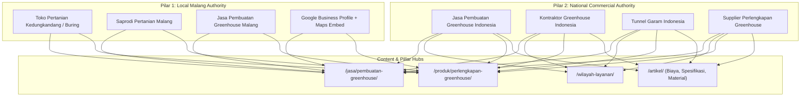

# SEO, Geo-Targeting & Cloudflare Edge Strategy — Agrokomplek Cemerlang

## 1. Dual-Core SEO Architecture (Hyper-Local + High-Intent National)

Agrokomplek Cemerlang menggunakan arsitektur SEO **Dual-Core**:
1. **Pilar Lokal (Local Authority - Malang & Jatim):** Menangkan pencarian dengan intensitas tinggi di Kota Malang, Kabupaten Malang, Kedungkandang, dan Buring untuk saprodi pertanian, alat pertanian, dan pembuatan greenhouse lokal.
2. **Pilar Nasional (National Commercial Lead Gen):** Menangkan keyword transaksional & investigasi komersial bernilai tinggi untuk kontraktor greenhouse, tunnel garam, dan suplai perlengkapan greenhouse di seluruh Indonesia.



---

## 2. Keyword Mapping Matrix & Target Routing

| Keyword Target | Intent | Volume / Priority | Halaman Target | Title Tag | H1 Tag |
|---|---|---|---|---|---|
| **jasa pembuatan greenhouse** | Transaksional Nasional | 10 / 10 | `/jasa/pembuatan-greenhouse/` | Jasa Pembuatan Greenhouse Indonesia \| Agrokomplek Cemerlang | Jasa Pembuatan Greenhouse untuk Berbagai Wilayah Indonesia |
| **jasa pembuatan greenhouse Malang** | Transaksional Lokal | 10 / 10 | `/jasa/pembuatan-greenhouse/` & `/` | Jasa Pembuatan Greenhouse Malang \| Agrokomplek Cemerlang | Jasa Pembuatan Greenhouse Malang & Jawa Timur |
| **kontraktor greenhouse Indonesia** | B2B Transaksional | 9.5 / 10 | `/jasa/pembuatan-greenhouse/` | Kontraktor Greenhouse Indonesia \| Agrokomplek Cemerlang | Kontraktor & Aplikator Greenhouse Seluruh Indonesia |
| **jasa greenhouse seluruh Indonesia** | Transaksional Nasional | 9.5 / 10 | `/wilayah-layanan/` | Jasa Greenhouse Seluruh Indonesia \| Agrokomplek Cemerlang | Layanan Pembuatan Greenhouse Seluruh Wilayah Indonesia |
| **toko pertanian Kedungkandang** | Transaksional Lokal | 9.5 / 10 | `/lokasi/` & `/` | Toko Pertanian di Kedungkandang Malang \| Agrokomplek | Toko Pertanian & Saprodi Kedungkandang Malang |
| **saprodi pertanian Malang** | Transaksional Lokal | 9.0 / 10 | `/produk/saprodi-pertanian/` | Saprodi Pertanian Malang \| Agrokomplek Cemerlang | Saprodi Pertanian Terlengkap di Malang & Nasional |
| **toko pertanian Malang** | Transaksional Lokal | 8.5 / 10 | `/` & `/lokasi/` | Toko Pertanian & Greenhouse Malang \| Agrokomplek | Pusat Kebutuhan Pertanian & Greenhouse di Malang |
| **biaya pembuatan greenhouse** | Commercial Investigation | 9.0 / 10 | `/artikel/biaya-pembuatan-greenhouse/` | Biaya Pembuatan Greenhouse: Faktor & Estimasi RAB \| Agrokomplek | Rincian Biaya Pembuatan Greenhouse & Faktor Penentu RAB |
| **harga greenhouse per meter** | Commercial Investigation | 9.0 / 10 | `/artikel/harga-greenhouse-per-meter/` | Harga Greenhouse per Meter: Cara Hitung & Spesifikasi \| Agrokomplek | Harga Greenhouse per Meter: Mengapa Tidak Bisa Dihitung Luas Saja |
| **jual plastik UV greenhouse** | Transaksional Produk | 9.0 / 10 | `/produk/plastik-uv-greenhouse/` | Jual Plastik UV Greenhouse 14%-20% \| Agrokomplek Cemerlang | Jual Plastik UV Greenhouse Kualitas Terbaik |
| **jual paranet Malang** | Transaksional Produk | 8.5 / 10 | `/produk/paranet/` | Jual Paranet Malang 65%-85% \| Agrokomplek Cemerlang | Jual Paranet Tanaman Berbagai Kerapatan di Malang |
| **pembuatan tunnel garam** | Transaksional Spesifik | 8.5 / 10 | `/jasa/pembuatan-greenhouse/` | Jasa Pembuatan Tunnel Garam Indonesia \| Agrokomplek Cemerlang | Spesialis Pembuatan Greenhouse & Tunnel Garam |

---

## 3. Structured Data (JSON-LD) Schemas

### A. LocalBusiness & Store (Homepage & Location Page)
```html
<script type="application/ld+json">
{
  "@context": "https://schema.org",
  "@type": "Store",
  "@id": "https://agrokomplekcemerlang.com/#business",
  "name": "Agrokomplek Cemerlang",
  "alternateName": "Toko Pertanian & Jasa Greenhouse Agrokomplek Cemerlang",
  "url": "https://agrokomplekcemerlang.com/",
  "logo": "https://agrokomplekcemerlang.com/images/brand/logo.png",
  "image": "https://agrokomplekcemerlang.com/images/hero/toko-agrokomplek-malang.webp",
  "description": "Pusat penjualan saprodi pertanian, perlengkapan greenhouse, dan kontraktor jasa pembuatan greenhouse di Malang untuk seluruh wilayah Indonesia.",
  "telephone": "+6285183002070",
  "email": "agrokomplekcemerlang@gmail.com",
  "priceRange": "Rp",
  "address": {
    "@type": "PostalAddress",
    "streetAddress": "Jl. KH. Malik Dalam RT 01 RW 07, Buring",
    "addressLocality": "Kedungkandang",
    "addressRegion": "Kota Malang, Jawa Timur",
    "postalCode": "65136",
    "addressCountry": "ID"
  },
  "geo": {
    "@type": "GeoCoordinates",
    "latitude": "-7.9984",
    "longitude": "112.6456"
  },
  "openingHoursSpecification": [
    {
      "@type": "OpeningHoursSpecification",
      "dayOfWeek": ["Monday", "Tuesday", "Wednesday", "Thursday", "Friday", "Saturday", "Sunday"],
      "opens": "00:00",
      "closes": "23:59"
    }
  ],
  "hasMap": "https://share.google/RkGZAeLgftgFwjqRo",
  "areaServed": [
    {
      "@type": "City",
      "name": "Malang"
    },
    {
      "@type": "Country",
      "name": "Indonesia"
    }
  ]
}
</script>
```

### B. Service Schema (Greenhouse Construction Service)
```html
<script type="application/ld+json">
{
  "@context": "https://schema.org",
  "@type": "Service",
  "@id": "https://agrokomplekcemerlang.com/jasa/pembuatan-greenhouse/#service",
  "name": "Jasa Pembuatan Greenhouse & Tunnel Garam",
  "serviceType": "Konstruksi & Instalasi Greenhouse Pertanian",
  "provider": {
    "@id": "https://agrokomplekcemerlang.com/#business"
  },
  "areaServed": {
    "@type": "Country",
    "name": "Indonesia"
  },
  "description": "Layanan konsultasi, desain, survei, fabrikasi, dan perakitan greenhouse bambu, galvanis, baja ringan, serta tunnel garam di seluruh Indonesia.",
  "offers": {
    "@type": "Offer",
    "availability": "https://schema.org/InStock",
    "priceCurrency": "IDR",
    "price": "0",
    "url": "https://agrokomplekcemerlang.com/jasa/pembuatan-greenhouse/"
  }
}
</script>
```

---

## 4. Google Business Profile & Local Citation Uniformity Guide
- **Business Name:** `Agrokomplek Cemerlang` *(DILARANG menambahkan keyword spam seperti "Agrokomplek Cemerlang - Jual Paranet Murah Termurah" untuk mencegah penalti Google Maps)*.
- **Primary Category:** `Agricultural service` / `Agricultural supply store` / `Farm equipment supplier`.
- **Secondary Category:** `Greenhouse builder` / `Garden center`.
- **Phone:** `0851-8300-2070`.
- **Tracking UTM Link:** `https://agrokomplekcemerlang.com/?utm_source=gbp&utm_medium=organic&utm_campaign=gmb-profile`.

---

## 5. Cloudflare Edge Technical SEO Optimization
1. **Edge Fast Caching (`_headers`):** Static assets cached at Cloudflare 300+ edge locations with `immutable` tags.
2. **Instant SSL & HTTP/3:** Full TLS 1.3 encryption with 0-RTT session resumption for instant mobile load in remote agricultural areas.
3. **Automated XML Sitemap:** `@astrojs/sitemap` integration configured for priority scores (P0: 1.0, Categories: 0.8, Articles: 0.7).
4. **Canonical URLs:** Strict trailing-slash consistency enforced at Cloudflare Edge via `_redirects`.
5. **Core Web Vitals Enforcement:** Zero external heavy render-blocking scripts; native lazy loading on images (`loading="lazy"` + `decoding="async"`); static font preloading.
6. **OpenGraph & Twitter Cards:** Dynamic OG generator with title, category badge, and brand watermark.
